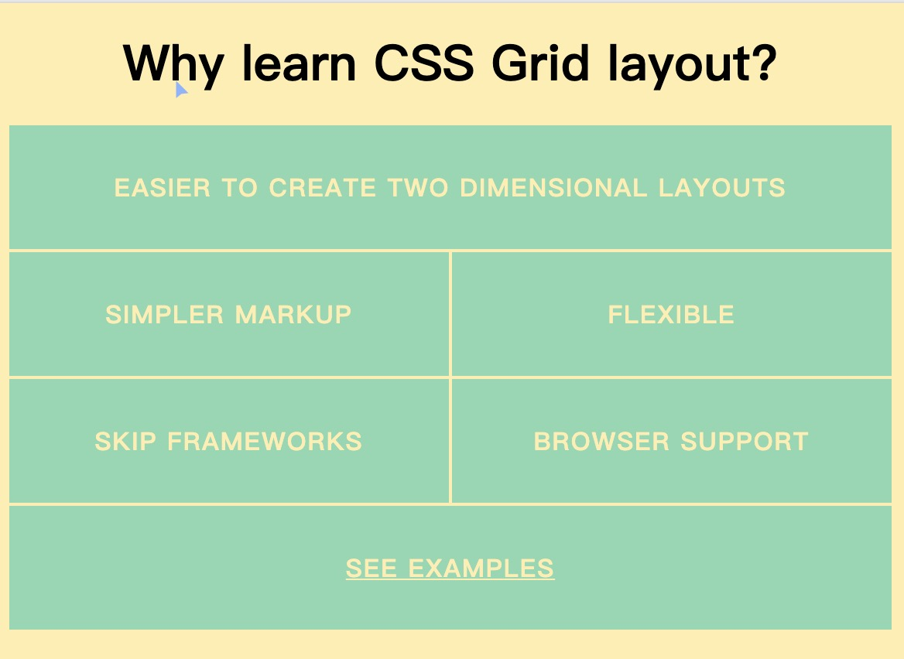
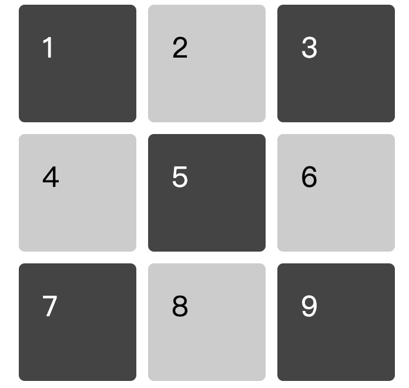
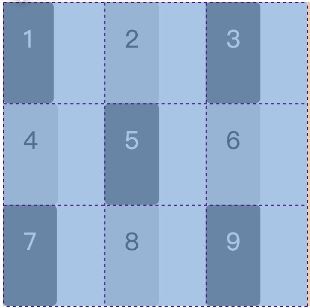
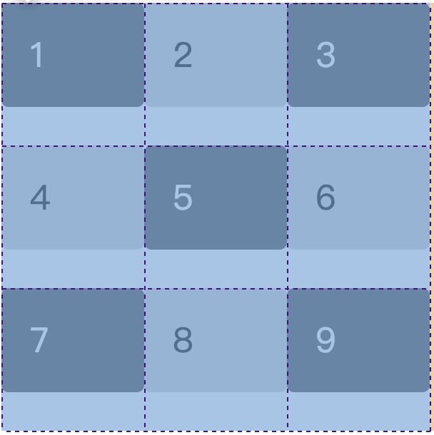
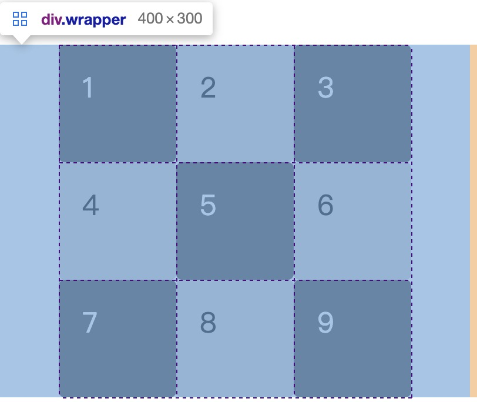
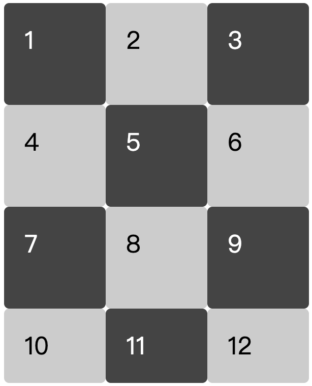
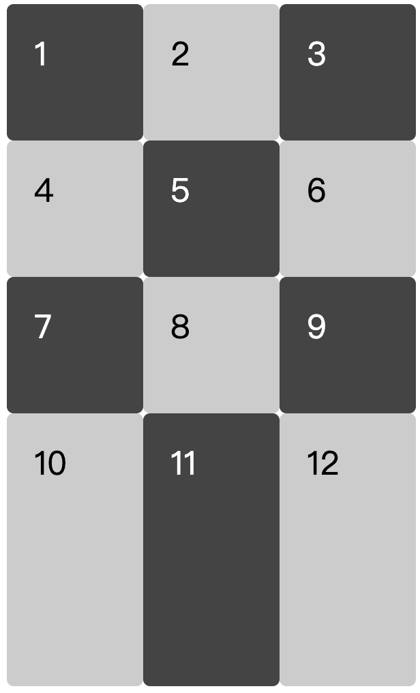
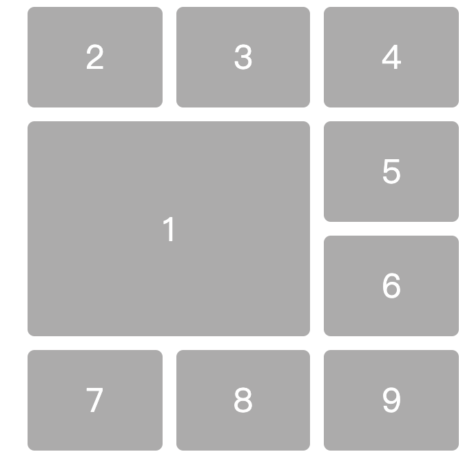

### Grid 布局

#### 背景介绍

web 开发中常见的布局方式：

- 定位布局(position)
- 浮动布局(float)
- flex 布局

这三种常见的布局方式中，我们一般使用最广泛的是 flex 布局，flex 布局也叫做弹性布局，可以说布局方式中简便效率最高的布局方式，但是在某些场景下 flex 的表现就没有那么随心所欲了，

flex 与 grid 的区别？

- flex 是一维的，grid 是二维的。flex 每一次设置的时候它是有方向的，通过 flx-direction 设置 row 和 column，默认是 row，所以 flex 每次只能作用于一个方向。grid 它本身就是属于二维，是一种更加全面的网格布局，类似于 bootstrap 一样的网格系统，但是 bootstrap 是通过库实现网格系统，而 grid 是浏览器本身支持的
- gird 在某些布局方面要比 flex 简单，html 元素嵌套的更少

比如说下面的这种布局

<!--  -->


#### 基本概念

- 容器与项目
  和 flex 的用法类似但是在 grid 中采取 grid 布局的区域称为容器（container），即 css 属性为 display:grid 的元素。容器内部的子元素，称为项目（item）

```html
<div class="container">
  <div class="item"></div>
  <div class="item"></div>
  <div class="item"></div>
</div>
```

因为 grid 是二维布局所以同时就会存在行和列，flex 布局我们只需要关心其中的一个，而 grid 需要我们在兼顾行的时候也需要兼顾列，反之亦然

- 网格线
  在创建一个网格容器时，会同时创建网格线，网格线同时也是网格单元格或网格区域之间的分界线，可以是行方向的，也可以是列方向的。下图中标识的黑底数字就是行（水平）网格线，灰底是列（垂直）网格线。网格线有编号、可以被命名且可以重名，用于网格的定位

通过 chrome 调试的时候，我们可以看到 grid 布局与其他的布局有个明显的差别就是在 chrome 上会有网格线的显示

- 网格单元格
  网络单元格是网格布局中的最小单位，它由 2 条相邻的行网格线和 2 条相邻的列网格线围起来的空间构成

- 网格间距
  网格间距是指两个网格轨道之间的间隙，这里不可以放置任何内容

- 网格轴
  在网格容器中，有两条轴分别用于块方向的对齐（列轴）和文本方向的对齐（行轴）

##### 容器属性

- display:grid

指定容器采用网格布局 当布局方式为网格布局的时候容器元素都是块级元素
注意，设为网格布局以后，容器子元素（项目）的 float、display: inline-block、display: table-cell、vertical-align 和 column-\*等设置都将失效。

- grid-template-columns，grid-template-rows

实现九宫格

```css
.wrapper {
  display: grid;
  grid-template-rows: 100px 100px 100px;
  /* 当行数过多时 grid-template-rows: repeat(3,100px) */
  grid-template-coloums: 100px 100px 100px;
  /* 当列数过多时 grid-template-colums: repeat(3,100px) */
}
```

```html
<div class="wrapper">
  <div class="box">1</div>
  <div class="box">2</div>
  <div class="box">3</div>
  <div class="box">4</div>
  <div class="box">5</div>
  <div class="box">6</div>
  <div class="box">7</div>
  <div class="box">8</div>
  <div class="box">9</div>
</div>
```

<!--  -->


1. grid-template-rows 和 grid-template-coloums

它们分别表示水平和竖直方向，即有几个参数就表示有几个行或者几列，可以使用的长度单位可以与现有的都一样，grid 布局还新增了一种单位 `fr`,1fr 就表示整体可用空间的一等份

2. auto-fill

有时，单元格的大小是固定的，但是容器的大小不确定。如果希望每一行（或每一列）容纳尽可能多的单元格，这时可以使用 auto-fill 关键字表示自动填充 `grid-template-colums: repeat(auto-fill,100px)`

3. auto

自适应长度 `grid-template-columns: 100px auto 100px;`,是通过容器大小确定的

4. minmax

它是一个函数，代表长度在这个范围之内，有两个参数，分别为最大值和最小值
`grid-template-rows:100px 100px minmax(100px,200px)`

- grid-row-gap,grid-colum-gap 属性表示行间隔与列间隔

```css
.wrapper {
  grid-row-gap: 10px;
  gird-coloum-gap: 10px;
  /* 简写形式等于 grid-gap: 10px 10px; */
}
```

- grid-auto-flow

默认的容器中的元素会按照从先行后列的方式排列，grid-auto-flow 表示可以让排列方式

```css
.wrapper {
  gird-auto-flow: column; /*先列后行*/
}
```

- justify-items,align-items

justify-items 设置单元格内容的水平位置 （start,end,center,stretch）

align-itesms 设置单元格内容的垂直位置 （start,end,center,stretch）

`justify-items: start`

<!--  -->


`align-items: start`

<!--  -->


简写形式`place-items: <align-items> <justify-items>`

- justify-content,align-content

justify-content 属性是整个内容区域在容器里面的水平位置
align-content 属性是整个内容区域的垂直位置

```css
align-content: start | end | center | stretch | space-around | space-between |
  space-evenly;
/* start 于网格容器沿行轴起始方向对齐
end 于网格容器沿行轴结束方向对齐
center 于网格容器沿行轴居中对齐
stretch 拉伸网格子元素使之占满整个网格容器
space-around 每列设置等距空白间隙，边缘间隙是中间间隙的一半
space-between 每列设置等距空白间隙，边缘无间隙
space-evenly 每列设置等距空白间隙，边缘间隙与中间间隙相同 */
```

```css
.wrapper {
  width: 400px;
  justify-content: center;
  /* 取值有start end center stretch spance-around space-between space-evenly */
}
```

<!--  -->


- grid-auto-columns,grid-auto-rows

当我们设置网格当时候，有点元素没有被设置进去，但是浏览器也会自动设置网格，唯一的区别就是浏览器设置的网格会根据单元格的大小来设置网格

例如：

```css
.wrapper{
    display:grid;
    grid-template-rows: 100px 100px 100px;
    grid-template-columns: 100px 100px 100px;
}

<div class="wrapper">
    <div class="box">1</div>
    <div class="box">2</div>
    <div class="box">3</div>
    <div class="box">4</div>
    <div class="box">5</div>
    <div class="box">6</div>
    <div class="box">7</div>
    <div class="box">8</div>
    <div class="box">9</div>
    <div class="box">10</div>
    <div class="box">11</div>
    <div class="box">12</div>
</div>
```



加上 grid-auto-rows 属性后

```css
.wrapper {
  display: grid;
  grid-template-rows: 100px 100px 100px;
  grid-template-columns: 100px 100px 100px;
  grid-auto-rows: 200px;
}
```



##### 项目属性

- 设置项目的位置

grid-column-start 属性：左边框所在的垂直网格线
grid-column-end 属性：右边框所在的垂直网格线
grid-row-start 属性：上边框所在的水平网格线
grid-row-end 属性：下边框所在的水平网格线

```css
.item1 {
  grid-column-start: 1;
  grid-column-end: 3;
  grid-row-start: 2;
  grid-row-end: 4;
}
```

<!-- <center>图8</center> -->


他们的属性值还可以使用`span`关键字，表示占多少个网格

用 span 实现上图的效果如下：

```css
.item1 {
  grid-column-start: span 2;
  grid-row-start: 2;
  grid-row-end: span 2;
}
```

简写： grid-column grid-row

```css
/* 缩写实现图8的效果 */
.item1 {
  grid-column: 1 / 3;
  gird-row: 2 / 4;
}
```

- grid-area

指定项目放在哪一个区域，前提是在容器里我们已经对项目进行了 `grid-template-areas`属性的设置

- justify-self,align-self

justify-self 属性设置单元格内容的水平位置（左中右），跟 justify-items 属性的用法完全一致，但只作用于单个项目。

align-self 属性设置单元格内容的垂直位置（上中下），跟 align-items 属性的用法完全一致，也是只作用于单个项目。

简写：

```css
place-self: <align-self> <justify-self>;
```

**参考文章**

- https://hackernoon.com/the-ultimate-css-battle-grid-vs-flexbox-d40da0449faf
- https://zhuanlan.zhihu.com/p/51082686
- http://www.ruanyifeng.com/blog/2019/03/grid-layout-tutorial.html
- https://www.zhangxinxu.com/wordpress/2018/11/display-grid-css-css3/
- https://scrimba.com/scrim/c2gd3T2
