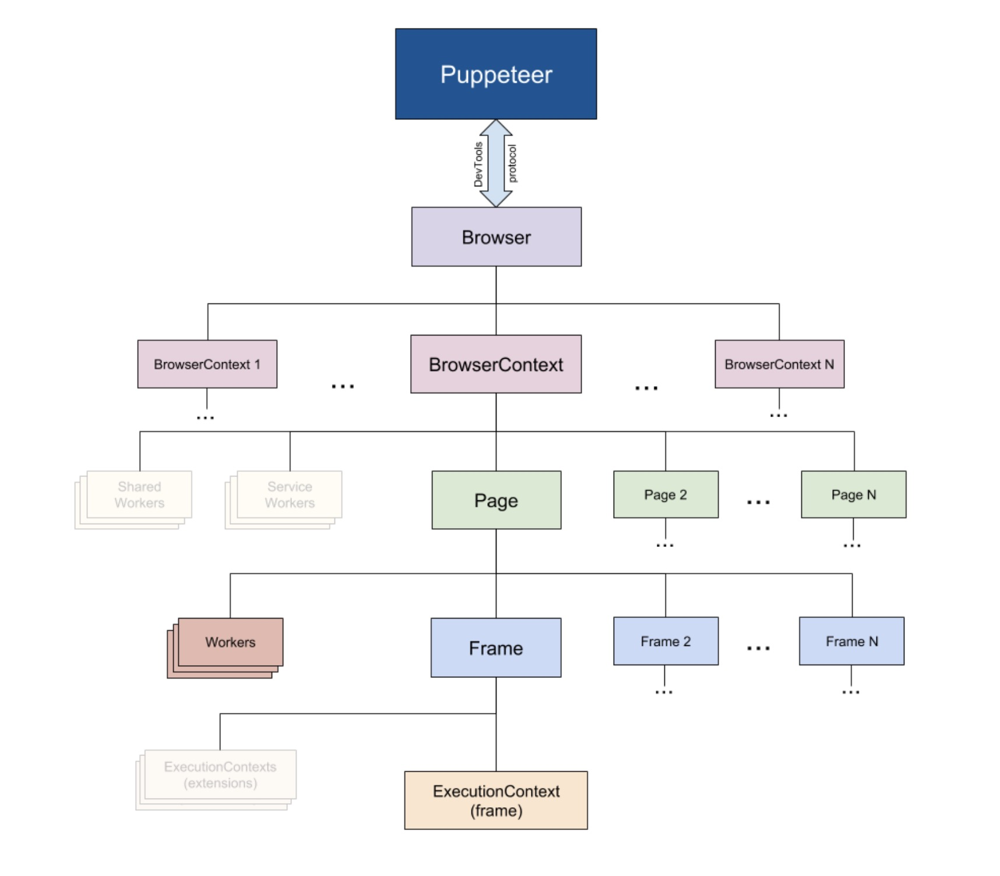
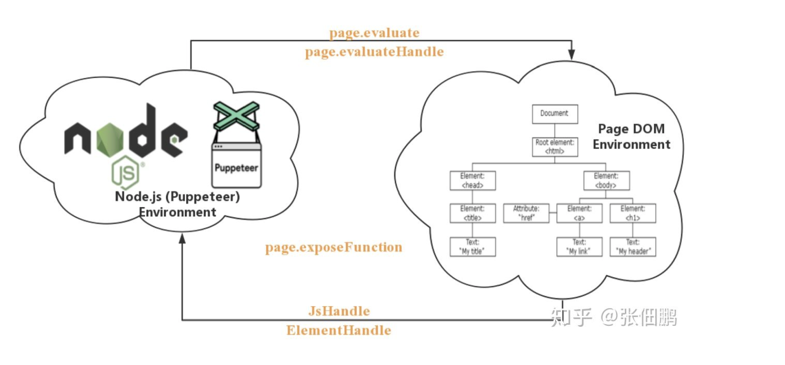

#puppeteer

## 介绍：

- Puppeteer 是一个 Node.js 库，它提供了一些高级 API 来操作 Chrome 和 Chromium 通过**DevTools 协议**，puppeteer 默认是不显示 chrome 或者 chromium 的，但是可以通过配置让它显示



**DevTools protocol**:Chrome DevTools 协议允许使用工具来检测，检查，调试和分析 Chromium，Chrome 和其他基于 Blink 的浏览器。 当前，许多现有项目都使用该协议。 Chrome DevTools 使用此协议，并且团队维护其 API。(基于 websocket，简单一句话来说就是可以通过这个协议自己去开发一些工具来获取 chrome 上页面的数据)

## 功能：

大部分的操作都可以使用 puppeteer 来实现

- 生成页面的屏幕截图和 PDF
- 抓取 SPA（单页应用程序）并生成预渲染的内容（即“ SSR”（服务器端渲染））
- 自动化表单提交，UI 测试，键盘输入等
- 创建最新的自动化测试环境。 使用最新的 JavaScript 和浏览器功能，直接在最新版本的 Chrome 中运行测试。
- 捕获站点的时间线跟踪，以帮助诊断性能问题。
- 测试 Chrome 扩展程序。

## 安装

1. 通过 npm i puppeteer 安装

默认安装都时候会下载一个最新版本的 Chromium

2. 如果不想下载 Chromium 的话，可以通过 npm i puppeteer-core

puppeteer-core 是一个轻量级的 pupeteer,通过打开一个已经存在的浏览器或者连接一个远程的浏览器来使用。

**支持 Typescript** 安装 `npm install --save-dev @types/puppeteer`

## 使用

Note: 从 puppeteer v3.0 起，支持 Node 10+的版本或者更高

使用其他浏览器测试框架的人会熟悉 Puppeteer。 您创建浏览器的实例，打开页面，然后使用 Puppeteer 的 API 对其进行操作

Example:

```js
const puppeteer = require("puppeteer");

(async () => {
  // 启动一个browser
  const browser = await puppeteer.launch({ headless: false });
  // 新建一个page
  const page = await browser.newPage();
  // 跳转url
  await page.goto("https://www.baidu.com");
  // 截图
  await page.screenshot({ path: "screenshot.png" }); //默认尺寸是800 x 600px ,
  // 关闭browser
  await browser.close();
})();
```

## 配置

- 使用无头模式

```js
const browser = await puppeteer.launch({ headless: false }); // default is true
```

- 运行 Chromium 的捆绑版本
  默认情况下，Puppeteer 下载并使用特定版本的 Chromium，因此可以保证其 API 可以直接使用。 要将 Puppeteer 与其他版本的 Chrome 或 Chromium 结合使用，请在创建浏览器实例时输入可执行文件的路径：

```js
const browser = await puppeteer.launch（{executablePath：'/ path / to / Chrome'}）;
```

## API 介绍及使用

- Browser： 对应一个浏览器实例，一个 Browser 可以包含多个 BrowserContext
- BrowserContext： 对应浏览器一个上下文会话，就像我们打开一个普通的 Chrome 之后又打开一个隐身模式的浏览器一样，BrowserContext 具有独立的 Session(cookie 和 cache 独立不共享)，一个 BrowserContext 可以包含多个 Page
- Page：表示一个 Tab 页面，通过 browserContext.newPage()/browser.newPage() 创建，browser.newPage() 创建页面时会使用默认的 BrowserContext，一个 Page 可以包含多个 Frame
- Frame: 一个框架，每个页面有一个主框架（page.MainFrame()）,也可以多个子框架，主要由 iframe 标签创建产生的
- ExecutionContext： 是 javascript 的执行环境，每一个 Frame 都一个默认的 javascript 执行环境
- ElementHandle: 对应 DOM 的一个元素节点，通过该该实例可以实现对元素的点击，填写表单等行为，我们可以通过选择器，xPath 等来获取对应的元素
- JsHandle：对应 DOM 中的 javascript 对象，ElementHandle 继承于 JsHandle，由于我们无法直接操作 DOM 中对象，所以封装成 JsHandle 来实现相关功能
- CDPSession：可以直接与原生的 CDP 进行通信，通过 session.send 函数直接发消息，通过 session.on 接收消息，可以实现 Puppeteer API 中没有涉及的功能
- Coverage：获取 JavaScript 和 CSS 代码覆盖率
- Tracing：抓取性能数据进行分析
- Response： 页面收到的响应

### 创建 browser 实例

    puppeteer 提供了两种方法用于创建一个 Browser 实例：

    puppeteer.connect: 连接一个已经存在的 Chrome 实例
    puppeteer.launch: 每次都启动一个 Chrome 实例

puppeteer.launch 每次都要重新启动一个 Chrome 进程，启动平均耗时 100 到 150 ms，性能欠佳
puppeteer.connect 可以实现对于同一个 Chrome 实例的共用，减少启动关闭浏览器的时间消耗
puppeteer.launch 启动时参数可以动态修改
通过 puppeteer.connect 我们可以远程连接一个 Chrome 实例，部署在不同的机器上
puppeteer.connect 多个页面共用一个 chrome 实例，偶尔会出现 Page Crash 现象，需要进行并发控制，并定时重启 Chrome 实例

### 加载导航页面

    page.goto：打开新页面
    page.goBack ：回退到上一个页面
    page.goForward ：前进到下一个页面
    page.reload ：重新加载页面
    page.waitForNavigation：等待页面跳转

### puppeteer 获取元素及属性

```js
page.$("#kw"); // selector

page.$$(".kw");
```

page.\$()执行的是`document.querySelector()`
page.\$\$()执行`document.querySelectorAll()`

通过此方法返回的是一个 ElementHandle 对象，并非真实的 DOM，

如果想要要操作真实的 DOM，可以使用\$eval()

```js
page.$evel("#kw", input => input.innerHTMl);

page.$$evel("img", img => img.innerHTML);
```



**两个独立环境：**运行 Puppeteer 的 Node.js 环境和 Puppeteer 操作的页面 Page DOM
首先 Puppeteer 提供了很多有用的函数去 Page DOM Environment 中执行代码，其次 Puppeteer 提供了 ElementHandle 和 JsHandle 将 Page DOM Environment 中元素和对象封装成对应的 Node.js 对象，这样可以直接这些对象的封装函数进行操作 Page DOM

### 键盘操作

```js
await page.keyboard.type("Hello World!"); // 输入

await page.keyboard.press("Backspace"); //正在按下

await page.keyboard.down("Shift"); // 已经按下 按下之后没释放会持续触发

await page.keyboard.up("Shift"); // 弹起

// Result text will end up saying 'Hello!'
```

### 鼠标操作

```js
await page.mouse.move(10, 200, { steps: 20 });
await page.mouse.down();
await page.mouse.up();
await page.mouse.move(10, 520, { steps: 160 });
await page.mouse.down();
await page.mouse.up();
```

### 模拟不同设备

```js
const iPhone = puppeteer.devices["iPhone 6"];
await page.emulate(iPhone);
```

### 执行 Javscript 方法

```js
await page.evaluate(() => {
  setTimeout(() => {
    document.querySelector("#su").value = "GOOGLE";
  }, 3000);
});
```

###

- 发送请求
- 响应请求

- puppeteer
- Browser
- Page
- ElementHandle
- keyboard
- Mouse

参考文献

- https://zhuanlan.zhihu.com/p/76237595
- https://pptr.dev/#?product=Puppeteer&version=v5.5.0&show=api-class-filechooser
- https://github.com/puppeteer/puppeteer/blob/main/src/common/USKeyboardLayout.ts
